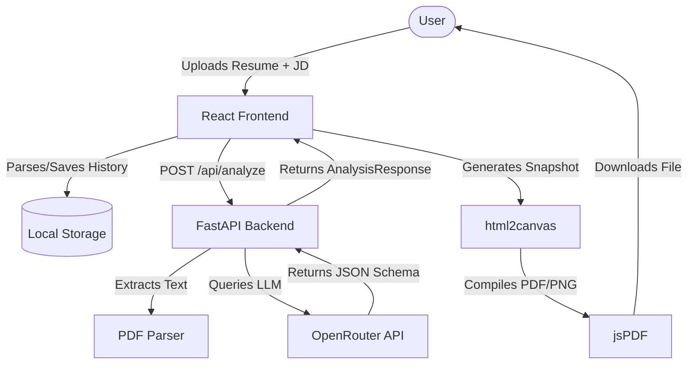

# ResumeIQ - AI Resume Analyzer & Optimizer

ResumeIQ is a professional, production-ready web application that parses, analyzes, and optimizes developer resumes against target job descriptions. By integrating with OpenRouter, ResumeIQ performs a comprehensive ATS (Applicant Tracking Systems) style compatibility check and provides detailed improvement suggestions, keyword matches, and a fully rewritten, optimized resume draft.

---

## 🚀 Key Features

- **PDF Parsing**: Instant text extraction from uploaded PDF resumes.
- **Tailored AI Analysis**: Evaluates resume match score, identifies professional strengths, lists critical gaps/weaknesses, and identifies matching vs. missing keywords.
- **Actionable Optimization Advice**: Delivers section-specific rewrite recommendations to improve ATS compatibility.
- **AI-Rewritten Draft**: Generates a complete, tailored resume draft incorporating all recommended changes while preserving authentic user experiences.
- **Model Selector**: Allows selection between various LLMs (e.g., Gemini 2.5 Flash, Claude 3.5 Sonnet, etc.) via OpenRouter.
- **Analysis Workspace & History**: Save, search, filter, and revisit past analyses locally in a workspace environment.
- **Configurable Export Options (Modal)**:
  - **PDF Report**: High-quality document export with section-level filters (Analysis Summary, Match Score, Strengths, Weaknesses, Recommendations, Improved Resume, Skills Breakdown, Resume Metadata, Job Description Metadata, AI Model Info) and quality options.
  - **PNG Snapshot**: Capture specific components or the entire analysis page as high-res images (1080p, 2K, 4K).
  - **Structured Data Export**: Download raw data in JSON, Markdown (MD), plain text (TXT), or recommendations in CSV format.

---

## 🛠️ System Design & Architecture

ResumeIQ consists of a decoupled frontend and backend service:

### Architectural Components
1. **Frontend (SPA)**:
   - Built with **React**, **Vite**, and **TypeScript**.
   - Styled using modern **Tailwind CSS** with responsive layout patterns.
   - Core libraries: `html2canvas` for snapshot generation, `jspdf` for PDF construction, and `lucide-react` for icon design.
   - **Local Storage**: Acts as a client-side database to persist analysis history and metadata.
2. **Backend (API)**:
   - Built with **FastAPI** (Python).
   - Core libraries: `pypdf` / `PyPDF2` (for PDF parsing), `httpx` and `openai` (for OpenRouter API requests), and `pydantic` (for input/output validation).
   - Configured with CORS middleware for secure communication with the frontend.

### Component Relationship Flow



---

## ⚙️ Prerequisites

- **Node.js**: `v18+`
- **Python**: `v3.11+`
- **Docker & Docker Compose** (Optional, for containerized setup)
- **OpenRouter API Key** (Get one at [openrouter.ai](https://openrouter.ai/))

---

## 📦 Installation & Setup

### Backend Setup

1. **Navigate to the backend directory**:
   ```bash
   cd backend
   ```
2. **Create and activate a virtual environment**:
   ```bash
   python -m venv venv
   # On Windows (PowerShell):
   .\venv\Scripts\Activate.ps1
   # On macOS/Linux:
   source venv/bin/activate
   ```
3. **Install dependencies**:
   ```bash
   pip install -r requirements.txt
   ```
4. **Configure Environment Variables**:
   Create a `.env` file from the example:
   ```bash
   cp .env.example .env
   ```
   Open `.env` and fill in your API Key and configure details:
   ```env
   OPENROUTER_API_KEY=your_openrouter_api_key_here
   OPENROUTER_MODEL=google/gemini-2.5-flash
   OPENROUTER_BASE_URL=https://openrouter.ai/api/v1
   APP_SITE_URL=http://localhost:5173
   APP_SITE_NAME=ResumeIQ
   ALLOWED_ORIGINS=http://localhost:5173
   ```
5. **Start the FastAPI server**:
   ```bash
   uvicorn main:app --reload
   ```
   The backend API will run at `http://localhost:8000`.

### Frontend Setup

1. **Navigate to the frontend directory**:
   ```bash
   cd ../frontend
   ```
2. **Install dependencies**:
   ```bash
   npm install
   ```
3. **Run the development server**:
   ```bash
   npm run dev
   ```
   The frontend application will run at `http://localhost:5173`.

---

## 🐳 Running with Docker Compose

To run the entire application stack in containerized mode:

1. **Configure Backend Environment**:
   Ensure `backend/.env` is set up with your `OPENROUTER_API_KEY`.
2. **Start the containers**:
   ```bash
   docker-compose up --build
   ```
3. **Access Services**:
   - Frontend UI: `http://localhost:5173`
   - Backend API Docs: `http://localhost:8000/docs`

---

## 🌐 Environment Variables Configuration

### Backend `.env` Variables

| Variable | Description | Default / Example |
| -------- | ----------- | ----------------- |
| `OPENROUTER_API_KEY` | Your OpenRouter API Access Token | `sk-or-v1-xxxx...` |
| `OPENROUTER_MODEL` | The default LLM to query | `google/gemini-2.5-flash` |
| `OPENROUTER_BASE_URL` | Base API URL for OpenRouter | `https://openrouter.ai/api/v1` |
| `APP_SITE_URL` | Site URL passed to OpenRouter headers | `http://localhost:5173` |
| `APP_SITE_NAME` | Site title passed to OpenRouter headers | `ResumeIQ` |
| `ALLOWED_ORIGINS` | Comma-separated list of permitted CORS origins | `http://localhost:5173` |

---

## 🚀 Deployment Guide (Render)

This application is ready for deployment on **Render** as a web service (backend) and a static site (frontend).

### 1. Backend Web Service
- **Environment**: `Python`
- **Root Directory**: `backend`
- **Build Command**: `pip install -r requirements.txt`
- **Start Command**: `uvicorn main:app --host 0.0.0.0 --port $PORT`
- **Environment Variables**: Add `OPENROUTER_API_KEY` and set `ALLOWED_ORIGINS` to your deployed Frontend URL.

### 2. Frontend Static Site
- **Environment**: `Node`
- **Root Directory**: `frontend`
- **Build Command**: `npm install && npm run build`
- **Publish Directory**: `dist`
