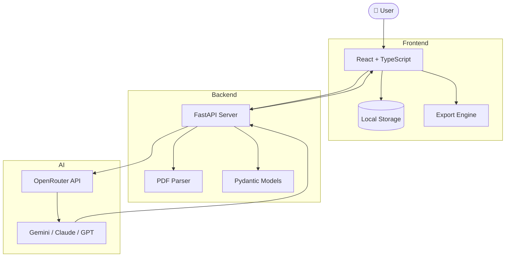
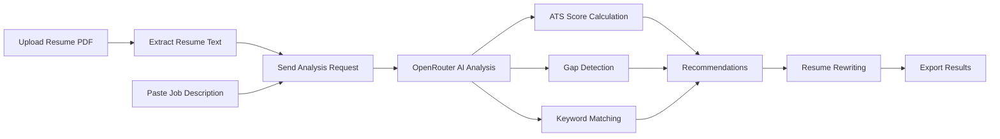
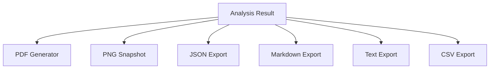

<div align="center">


# 🚀 ResumeIQ

### AI-Powered Resume Analyzer, ATS Optimizer & Resume Rewriter

<p>


</p>

**Parse • Analyze • Optimize • Rewrite • Export**

</div>

---

## 🎯 Overview

ResumeIQ is a production-ready AI-powered platform that helps software engineers and professionals optimize resumes for specific job descriptions.

The system performs:

- ATS Compatibility Analysis
- Resume-to-JD Matching
- Skill Gap Detection
- Keyword Analysis
- Resume Rewriting
- Professional Recommendation Generation
- Multi-format Report Exporting

---
## ✨ Core Features

### 📄 Intelligent Resume Parsing

- PDF Upload Support
- Instant Text Extraction
- Metadata Detection

### 🎯 ATS Compatibility Analysis

- Match Score Generation
- Keyword Coverage
- Recruiter Readability Evaluation

### 🤖 AI Resume Optimization

- Section Rewrite Suggestions
- Professional Improvements
- Skill Enhancement Recommendations

### 🔍 Gap Analysis

- Missing Skills Detection
- Missing Keywords
- Weak Section Identification

### 📝 AI Resume Rewriter

- Complete Resume Redrafting
- ATS Optimized Formatting
- Context-Aware Improvements

### 📊 Workspace & History

- Local Analysis Storage
- Search and Filter
- Quick Reopen

### 📤 Advanced Exporting

- PDF Reports
- PNG Snapshots
- Markdown
- JSON
- CSV
- TXT
- Multi-format Report Exporting

Powered by OpenRouter and modern LLMs including Gemini, Claude, and GPT models.
---
## 🛠 Technology Stack

### Frontend

| Technology | Purpose |
|------------|----------|
| React 19 | UI Framework |
| TypeScript | Type Safety |
| Vite | Build Tool |
| Tailwind CSS | Styling |
| html2canvas | Snapshot Generation |
| jsPDF | PDF Export |
| Lucide React | Icons |
---
### Backend

| Technology | Purpose |
|------------|----------|
| FastAPI | REST API |
| Python 3.11 | Runtime |
| Pydantic | Validation |
| PyPDF2 | PDF Parsing |
| HTTPX | API Communication |
| OpenAI SDK | OpenRouter Integration |
---
### AI Layer

| Service | Usage |
|----------|---------|
| OpenRouter | Unified AI Gateway |
| Gemini 2.5 Flash | Fast Analysis |
| Claude 3.5 Sonnet | Detailed Reasoning |
| GPT Models | Alternative Analysis |

---
## 🏗 System Architecture


---
## 🔄 Resume Analysis Workflow


---
## 📤 Export Pipeline


---
## 📁 Project Structure

```text
ResumeIQ/
│
├── backend/
│   │
│   ├── analyzer.py               # AI analysis engine
│   ├── parser.py                 # PDF text extraction
│   ├── models.py                 # Pydantic schemas
│   ├── main.py                   # FastAPI application entry
│   ├── requirements.txt          # Python dependencies
│   ├── Dockerfile                # Backend container
│   ├── .env.example              # Environment template
│   └── .env                      # Local environment variables
│
├── frontend/
│   │
│   ├── public/
│   │
│   ├── src/
│   │   │
│   │   ├── api/
│   │   │   └── resumeApi.ts
│   │   │
│   │   ├── assets/
│   │   │   ├── hero.png
│   │   │   ├── react.svg
│   │   │   └── vite.svg
│   │   │
│   │   ├── components/
│   │   │   ├── ExportModal.tsx
│   │   │   ├── Header.tsx
│   │   │   ├── ImprovementCard.tsx
│   │   │   ├── Loader.tsx
│   │   │   ├── ModelSelector.tsx
│   │   │   ├── ResultPanel.tsx
│   │   │   ├── ResumeCharts.tsx
│   │   │   ├── ScoreCard.tsx
│   │   │   └── UploadZone.tsx
│   │   │
│   │   ├── pages/
│   │   │   ├── Home.tsx
│   │   │   ├── AnalysisDetail.tsx
│   │   │   └── HistoryWorkspace.tsx
│   │   │
│   │   ├── types/
│   │   │   └── index.ts
│   │   │
│   │   ├── utils/
│   │   │   └── history.ts
│   │   │
│   │   ├── App.tsx
│   │   ├── App.css
│   │   ├── main.tsx
│   │   └── index.css
│   │
│   ├── index.html
│   ├── package.json
│   ├── package-lock.json
│   ├── vite.config.ts
│   ├── tsconfig.json
│   ├── tsconfig.app.json
│   ├── tsconfig.node.json
│   ├── eslint.config.js
│   ├── Dockerfile
│   └── README.md
│
├── docker-compose.yml
├── .gitignore
└── README.md
```
---
# 🚀 Quick Start

## 1️⃣ Clone Repository

```bash
git clone https://github.com/LoganthP/ResumeIQ.git
cd ResumeIQ
```
---

# ⚙️ Environment Configuration

Create a `.env` file inside the `backend/` directory:

```env
OPENROUTER_API_KEY="your_openrouter_key_here"
OPENROUTER_MODEL=google/gemini-2.5-flash
OPENROUTER_BASE_URL=https://openrouter.ai/api/v1

APP_SITE_URL=http://localhost:5173
APP_SITE_NAME=ResumeIQ
```

> Replace `your_openrouter_key_here` with your actual OpenRouter API key.

---

# 🔧 Backend Setup

Navigate to the backend directory:

```bash
cd backend
```

### Create Virtual Environment

```bash
python -m venv venv
```

### Activate Virtual Environment

#### Windows (PowerShell)

```powershell
.\venv\Scripts\Activate.ps1
```

#### Windows (Command Prompt)

```cmd
venv\Scripts\activate.bat
```

#### macOS / Linux

```bash
source venv/bin/activate
```

### Install Dependencies

```bash
pip install -r requirements.txt
```

### Create Environment File

#### Windows (Command Prompt)

```cmd
copy .env.example .env
```

#### Windows (PowerShell) / macOS / Linux

```bash
cp .env.example .env
```

Update the `.env` file with your OpenRouter API key.

### Start Backend Server

```bash
uvicorn main:app --reload
```

### Backend URLs

```text
Backend API:
http://localhost:8000

Swagger Documentation:
http://localhost:8000/docs
```

---

## ⚡ Quick Backend Start (Windows)

```powershell
cd backend
python -m venv venv
.\venv\Scripts\activate
pip install -r requirements.txt
uvicorn main:app --reload
```

---

# 🎨 Frontend Setup

Open a new terminal window:

```bash
cd frontend
```

### Install Dependencies

```bash
npm install
```

### Start Development Server

```bash
npm run dev
```

### Frontend URL

```text
http://localhost:5173
```
---

# 🌐 Application Endpoints

| Service | URL |
|----------|-----|
| Frontend | http://localhost:5173 |
| Backend API | http://localhost:8000 |
| API Documentation | http://localhost:8000/docs |

---

# 🐳 Docker Setup

### Build and Run

```bash
docker-compose up --build
```

### Run in Detached Mode

```bash
docker-compose up -d
```

### Stop Containers

```bash
docker-compose down
```

### Access Services

| Service | URL |
|----------|-----|
| Frontend | http://localhost:5173 |
| Backend API | http://localhost:8000 |
| API Documentation | http://localhost:8000/docs |

---
## 🛣️ Roadmap

### Planned Features

- [ ] User Authentication
- [ ] Cloud-Based Analysis History
- [ ] Resume Version Comparison
- [ ] Cover Letter Generator
- [ ] LinkedIn Profile Analysis
- [ ] Multi-Resume Management
- [ ] Team Collaboration Workspace
- [ ] ATS Simulation Engine
- [ ] One-Click Resume Export Templates

---

## 🛣️ Future Enhancements

- [ ] AI Cover Letter Generator
- [ ] LinkedIn Profile Analysis
- [ ] Resume Section-Level Scoring
- [ ] ATS Formatting Validation
- [ ] Resume Version Comparison
- [ ] Cloud-Based Analysis History
- [ ] User Authentication & Profiles
- [ ] GitHub Profile Integration
- [ ] AI Interview Preparation Assistant
- [ ] Personalized Career Recommendations
- [ ] Job Match Prediction
- [ ] Smart Resume Templates
